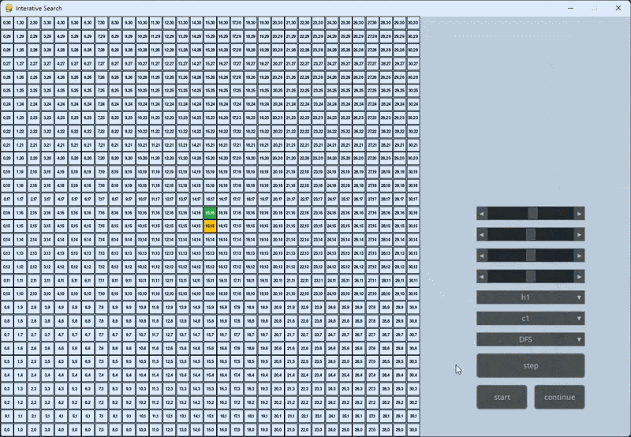

# pygame-visualize-graph-search

A Python application for visualizing graph search algorithms. Built with `pygame` and `pygame-gui`.



## Features
* Supported algorithms: DFS, BFS, UCS, Greedy Search, A*.
* Configurable start and goal coordinates via UI sliders.
* Selectable cost and heuristic functions.
* Execution controls: Start, pause, abort, and step-by-step execution.

## Cost Functions

| ID | Description |
|---|---|
| **c1** | Uniform cost of $10$ for all directions. |
| **c2** | Cost $15$ for horizontal directions, $10$ for vertical direcations. |
| **c3** | Cost $10 + (\|5 - \text{depth}\| \mod 6)$ for horizontal directions, $10$ for vertical directions. |
| **c4** | Cost $5 + (\|10 - \text{depth}\| \mod 11)$ for horizontal direcations, $10$ for vertical directions. |


## Heuristic Functions

| ID | Type | 
|---|---|
| **h1** | Euclidean Distance | 
| **h2** | Manhattan Distance |

## Requirements
* Python >= 3.13
* `uv` (Package manager)

## Installation & Usage

1. Sync project dependencies using `uv`:
```bash
uv sync
```

2. Run the application:
```bash
uv run src/main.py
```

## Controls

| Action | Input |
|---|---|
| Start Search | `UI Button` |
| Abort Search | `UI Button` |
| Pause / Continue | `UI Button` |
| Step-by-step | `UI Button` |
| Scale Grid | `Mouse Wheel` or `Up`/`Down` Arrows |
| Quit | `Q` |
